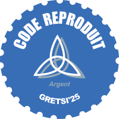

# Weighted tensorised fractional Brownian textures - Synthesis and analysis

**_Dépôt labelisé dans le cadre du [Label Reproductible du GRESTI'25](https://gretsi.fr/colloque2025/recherche-reproductible/)_**

| Label décerné | Auteur | Rapporteur | Éléments reproduits | Liens |
|:-------------:|:------:|:----------:|:-------------------:|:------|
|  | Claire LAUNAY [@claunay](https://github.com/claunay) | Marc DONIAS [@MarcDonias](https://github.com/MarcDonias) |  Figures 1 et 2 Table 1 | 📌&nbsp;[Dépôt&nbsp;original](https://github.com/claunay/wtfbf) ⚙️&nbsp;[Issue](https://github.com/GRETSI-2025/Label-Reproductible/issues/25) 📝&nbsp;[Rapport](https://github.com/akrah/test/tree/main/rapports/Rapport_issue_25) |

## Overview

This project provides matlab scripts for generating and analyzing weighted tensorised fractional brownian fields (WTFBF). 
The texture synthesis file generates new textures based on the spectral representation method, while the analysis file offer various metrics to evaluate texture auto-similarity and rectangular increments stationarity. 
These scripts reproduce the results given in the preprint 'Weighted tensorized fractional Brownian textures', Céline Esser, Claire Launay, Laurent Loosveldt, Béatrice Vedel, March 2025.

## Files

- **Texture Synthesis**: Generate textures based the spectral representation method.
- **Texture Analysis**: Analyze textures for properties like texture auto-similarity and rectangular increments stationarity.
- **Skewness**: A fonction to compute the samples' skewness

## Requirements

- A Matlab license 

## Usage

### Texture Synthesis

To generate the textures presented in the preprint 'Weighted tensorized fractional Brownian textures', open the script 'wtfbf_synthesis.m' and run it.

This will create 14 figures associated with a fixed seed :
- 6 samples of WTFBF, of size 512x512, with parameters H = 0.3 or 0.7, and alpha = 0, 0.5 and 1.
- one sample of a fractional Brownian field, of size 512x512, with parameter H = 0.3.
- one sample of a fractional Brownian sheet, of size 512x512, with parameter H = 0.3.
- 6 samples of anisotropic WTFBF, of size 512x512, with parameters H = 0.4, beta1 = 0.7, beta2 = 1.3 and alpha = 0, 0.5 or 1, or with parameters H = 0.6, beta1 = 0.85, beta2 = 1.15 and alpha = 0, 0.5 or 1.

### Texture Analysis

The file 'wtfbf_analysis.m' reproduces the quantitative results in the preprint 'Weighted tensorized fractional Brownian textures'. To obtain the same results as in the preprint, run the script.

It generates 100 samples of WTFBF and computes the estimated mean, variance and skewness of the generated textures. 
It compares it with the estimated mean, variance and skewness of the associated rectangular increments, to assess stationarity, and with the estimated mean, variance and skewness of the associated rescaled fields, to test auto-similarity.

## References

- 'Weighted tensorized fractional Brownian textures', Céline Esser, Claire Launay, Laurent Loosveldt, Béatrice Vedel, March 2025 (https://arxiv.org/pdf/2406.03313).
